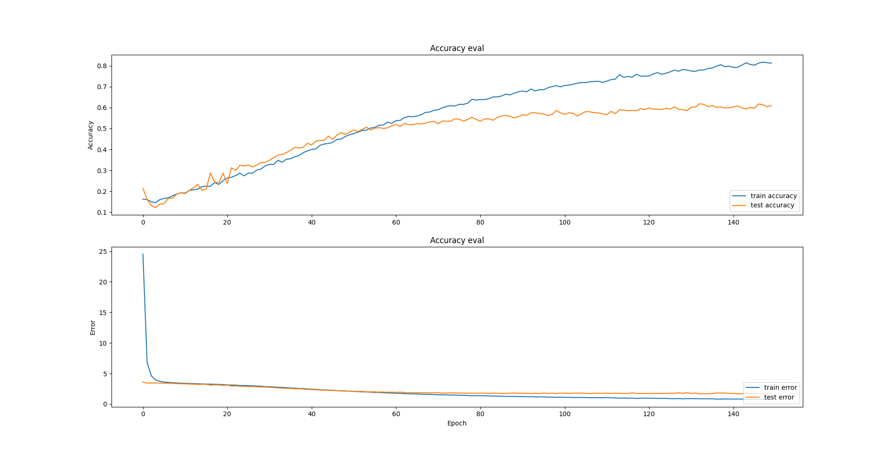
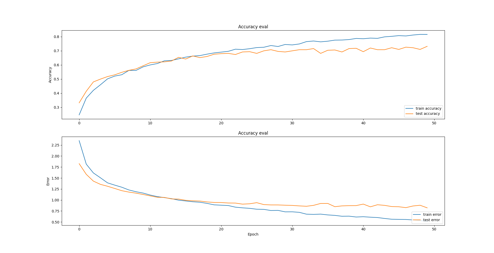
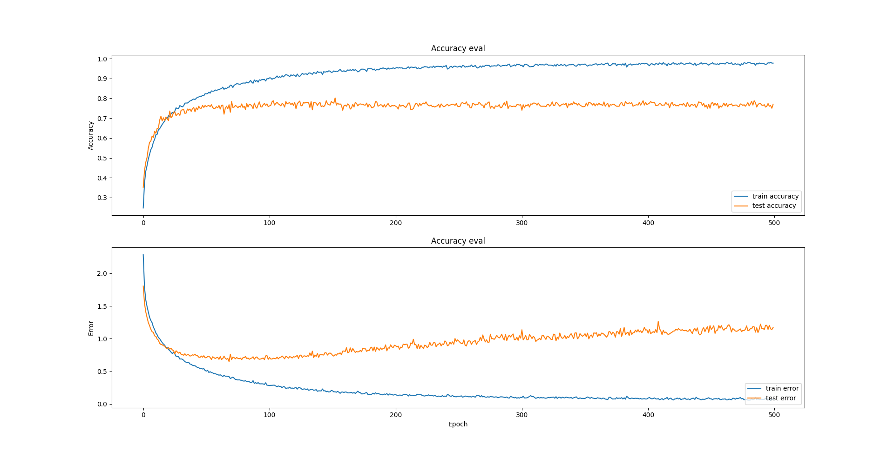
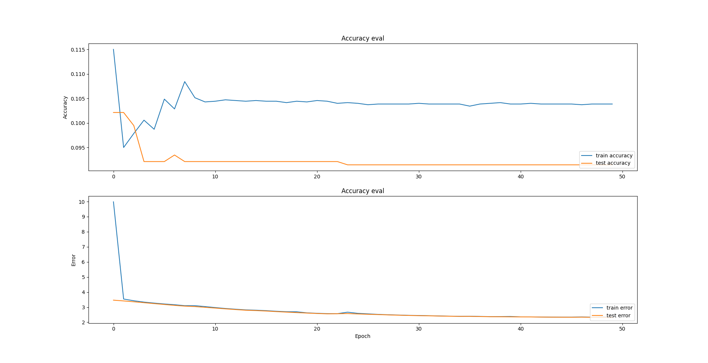
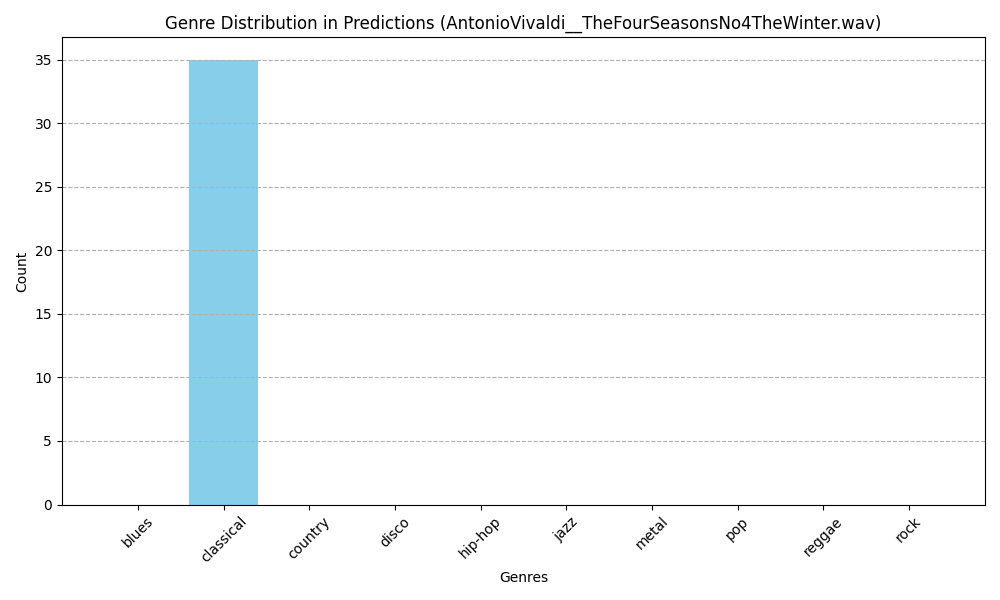
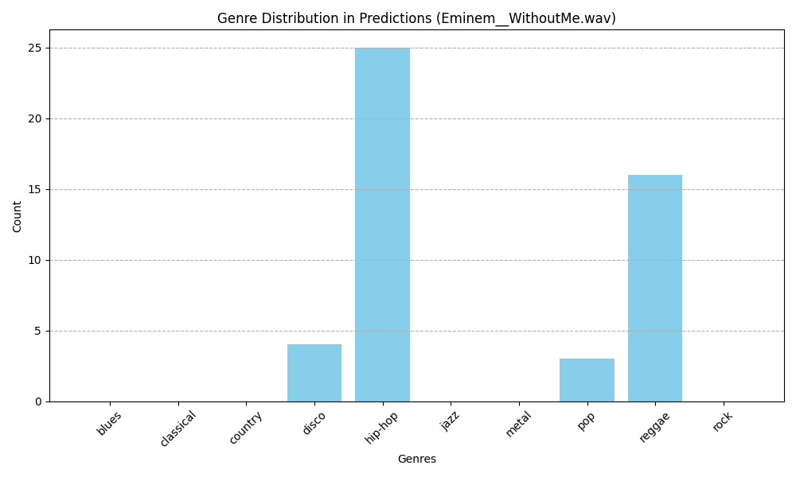
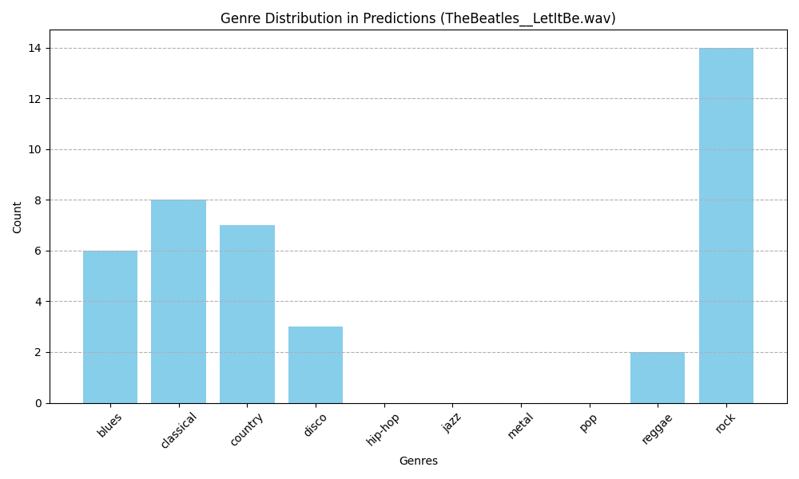
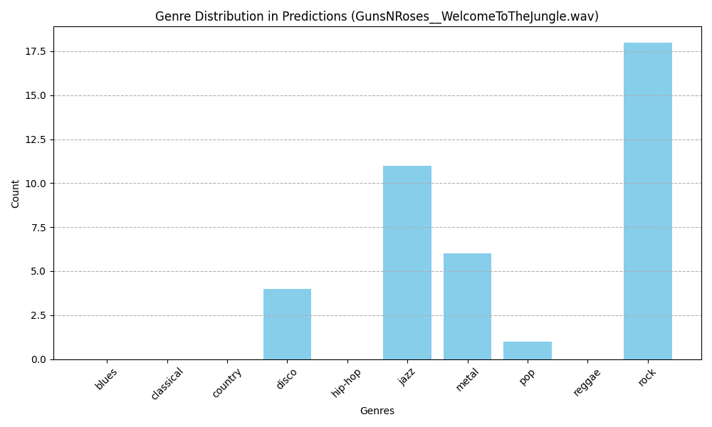

# Music Genre Classification
This repository contains three different ML models to classify a music record as one of ten genres. The dataset used for the trainig was taken from: [Kaggle - GTZAN Dataset for Music Genre Classification.](https://www.kaggle.com/datasets/andradaolteanu/gtzan-dataset-music-genre-classification)
Music genres: blues, classical, country, disco, hip-hop, jazz, metal, pop, raggae, rock

## Feature engineering 
As features for this task I took 13 Mel-frequency cepstral coefficients (MFCCs) that were calculated on 6 seconds long fragments of songs with predefined genre. The dataset includes 10 genres and 100 segments for each genre, so we the total amount of training units is equal to 5'000. 
Every song that will be classified is divided into segments that will be used to calculate the coeficients. The default value for number of segmets is set, hovewer if the song can be divided in the smaller amount of segments, the value will be changen. It worthes to notice, that the order of segments will be schuffled. 
At the end of execution a histogram with the distribution of predictions will be showed as the output. 
### MFCCs
From [Wikipedia](https://en.wikipedia.org/wiki/Mel-frequency_cepstrum)
>In sound processing, the mel-frequency cepstrum (MFC) is a representation of the short-term power spectrum of a sound, based on a linear cosine transform of a log power spectrum on a nonlinear mel scale of frequency.
>Mel-frequency cepstral coefficients (MFCCs) are coefficients that collectively make up an MFC. They are derived from a type of cepstral representation of the audio clip (a nonlinear "spectrum-of-a-spectrum"). The difference between the cepstrum and the mel-frequency cepstrum is that in the MFC, the frequency bands are equally spaced on the mel scale, which approximates the human auditory system's response more closely than the linearly-spaced frequency bands used in the normal spectrum. This frequency warping can allow for better representation of sound, for example, in audio compression that might potentially reduce the transmission bandwidth and the storage requirements of audio signals.
>MFCCs are commonly derived as follows:
>  1. Take the Fourier transform of (a windowed excerpt of) a signal.
>  2. Map the powers of the spectrum obtained above onto the mel scale, using triangular overlapping windows or alternatively, cosine overlapping windows.
>  3. Take the logs of the powers at each of the mel frequencies.
>  4. Take the discrete cosine transform of the list of mel log powers, as if it were a signal.
>  5. The MFCCs are the amplitudes of the resulting spectrum.

## MLP
Accuracy on test set (50 epochs): 0,6091455221176147

## CNN
Accuracy on test set (50 epochs): 0,7571356892585754

Accuracy on test set (500 epochs): 0,7671507000923157

## RNN-LSTM
Accuracy on test set (50 epochs): 0,6659989953041077

## Results
Histograms show how many segments of the song were identified as which genre. Also check sub-directory "bloopers" for incorrect outputs.

## References
[Deep Learning (for Audio) with Python](https://youtube.com/playlist?list=PL-wATfeyAMNrtbkCNsLcpoAyBBRJZVlnf&si=n75apVs848NUcqYI) — Valerio Velardo - The Sound of AI

[Signal Processing](https://youtube.com/playlist?list=PL8hTotro6aVFzbU43bXF9jAHJSvsu725f&si=3CeIWYaio9Aq0hnc) — DataMListic
