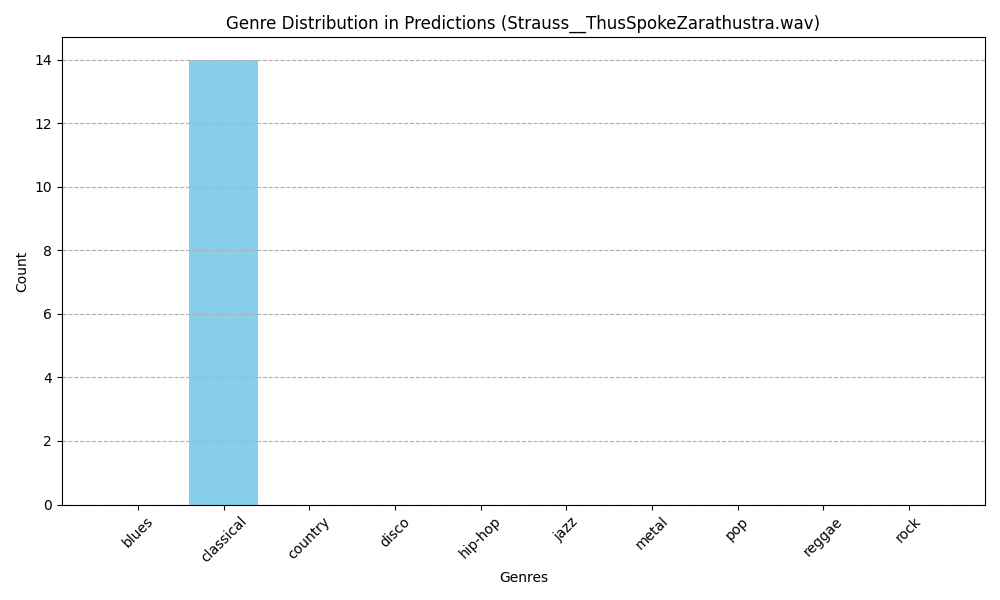

# Music Genre Classification

This repository contains three different machine learning models used to classify a music recording into one of ten genres. The dataset used for training is the [GTZAN Dataset for Music Genre Classification](https://www.kaggle.com/datasets/andradaolteanu/gtzan-dataset-music-genre-classification) from Kaggle.

### Supported Music Genres:
- blues
- classical
- country
- disco
- hip-hop
- jazz
- metal
- pop
- reggae
- rock

## Feature Engineering

### MFCC Extraction
The main feature used for this task is the **13 Mel-frequency cepstral coefficients (MFCCs)**, calculated on 6-second-long segments of songs with a predefined genre. The dataset includes 10 genres, each with 100 segments, resulting in a total of **5,000 training units**.

To classify a new song, the audio is divided into segments, and MFCCs are calculated for each segment. The default value for the number of segments is predefined, but if a song can be divided into fewer segments, the value is adjusted accordingly. It is important to note that the segments are shuffled before analysis to provide diverse input to the model.

After classification, a histogram is generated to show the distribution of predicted genres for all segments of the song.

### Mel-Frequency Cepstral Coefficients (MFCCs)
From [Wikipedia](https://en.wikipedia.org/wiki/Mel-frequency_cepstrum):
> In sound processing, the mel-frequency cepstrum (MFC) is a representation of the short-term power spectrum of a sound, based on a linear cosine transform of a log power spectrum on a nonlinear mel scale of frequency.
>
> Mel-frequency cepstral coefficients (MFCCs) are coefficients that collectively make up an MFC. They are derived from a type of cepstral representation of the audio clip (a nonlinear "spectrum-of-a-spectrum"). The difference between the cepstrum and the mel-frequency cepstrum is that in the MFC, the frequency bands are equally spaced on the mel scale, which approximates the human auditory system's response more closely than the linearly-spaced frequency bands used in the normal spectrum. This frequency warping allows for better representation of sound, such as in audio compression that reduces the transmission bandwidth and the storage requirements of audio signals.
>
> MFCCs are commonly derived as follows:
>  1. Take the Fourier transform of (a windowed excerpt of) a signal.
>  2. Map the powers of the spectrum obtained above onto the mel scale, using triangular overlapping windows or alternatively, cosine overlapping windows.
>  3. Take the logarithms of the powers at each of the mel frequencies.
>  4. Take the discrete cosine transform of the list of mel log powers, as if it were a signal.
>  5. The MFCCs are the amplitudes of the resulting spectrum.

## Model Architectures

### Multi-Layer Perceptron (MLP)
- **Accuracy on Test Set (50 epochs)**: 0.6091
- 

### Convolutional Neural Network (CNN)
- **Accuracy on Test Set (50 epochs)**: 0.7571
- 

- **Accuracy on Test Set (500 epochs)**: 0.7671
- 

### Recurrent Neural Network - Long Short-Term Memory (RNN-LSTM)
- **Accuracy on Test Set (50 epochs)**: 0.6660
- 

## Results

The histograms below show the distribution of genres identified for each segment of a song. These illustrate how many segments were classified into each genre. Additionally, you can check the "bloopers" sub-directory for incorrect outputs and edge cases.

### Sample Results:

- **Antonio Vivaldi - The Four Seasons No.4 (The Winter)**  
  

- **Strauss - Thus Spoke Zarathustra**  
  

- **Johnny Cash - Hurt**  
  

- **Bob Marley - Three Little Birds**  
  

- **Eminem - Without Me**  
  

- **Michael Jackson - Beat It**  
  

- **The Beatles - Let It Be**  
  

- **Guns N' Roses - Welcome to the Jungle**  
  

## References
- [Deep Learning (for Audio) with Python](https://youtube.com/playlist?list=PL-wATfeyAMNrtbkCNsLcpoAyBBRJZVlnf&si=n75apVs848NUcqYI) — Valerio Velardo - The Sound of AI
- [Signal Processing](https://youtube.com/playlist?list=PL8hTotro6aVFzbU43bXF9jAHJSvsu725f&si=3CeIWYaio9Aq0hnc) — DataMListic
